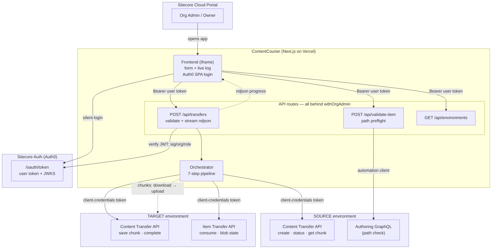
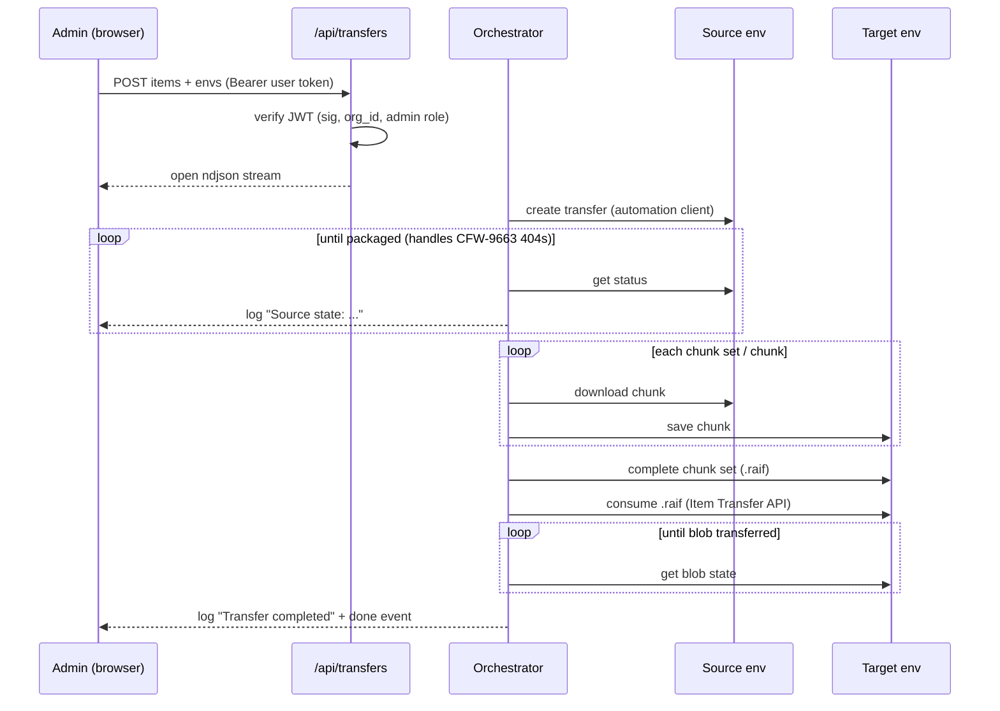

# ContentCourier — Sitecore Marketplace Content Transfer App

A private (org-level) Sitecore Marketplace app for transferring content between
SitecoreAI environments, built on the [Content Transfer API and Item Transfer
API](https://developers.sitecore.com/changelog/sitecoreai/01072026/content-transfer-api-and-item-transfer-api-now-available)
(July 2026). Based on [Sitecore/marketplace-starter](https://github.com/Sitecore/marketplace-starter).

Access is restricted to **Organization Admins / Owners** — enforced
server-side on every API route, not just by app visibility.

## What it does

Admins pick an item path (with a "check path exists" preflight against the
source), source and target environments, scope (single item / item and
descendants), and a merge strategy (override / keep / latest-win / override
tree). The app then runs the 7-step transfer pipeline and streams progress
live to the browser:

1. Create transfer on the **source** (`Content Transfer API`)
2. Poll status until chunk sets are packaged (`ChunkSetsMetadata`)
3. Download each chunk from the source
4. Upload each chunk to the **target**
5. Complete the chunk set (assembles a `.raif` file)
6. Consume the `.raif` file into the target database (`Item Transfer API`)
7. Poll blob state until consumed

## Architecture

**Transfer sequence (backend mode):**

### `backend` mode (default — the one that works today)

The Content Transfer API is **not yet grantable** under Marketplace "API
access", so the transfer runs in this app's own API routes:

- The frontend obtains a Sitecore **user token** via Auth0 (custom
  authorization, SPA client credentials) in [providers.tsx](src/app/providers.tsx).
- Every API route is wrapped in [`withOrgAdmin`](src/lib/auth/guard.ts), which
  verifies the JWT (JWKS signature, issuer, audience), the `org_id` claim, and
  the Organization Admin/Owner role ([verify-user.ts](src/lib/auth/verify-user.ts)).
- The transfer itself uses per-environment **automation clients**
  (client-credentials, server-side only) and runs *inside the POST request*,
  streaming progress as newline-delimited JSON
  ([transfers/route.ts](src/app/api/transfers/route.ts),
  [orchestrator.ts](src/lib/sitecore/orchestrator.ts)). This is deliberate:
  fire-and-forget + polling does not work on serverless hosts, because each
  function instance has its own memory.
- The path check ([validate-item/route.ts](src/app/api/validate-item/route.ts))
  queries `{CM host}/sitecore/api/authoring/graphql/v1` with the automation
  client — doubling as a preflight that proves the client can authenticate
  before you start a transfer.

### `sdk` mode (switch later)

`@sitecore-marketplace-sdk/xmc` already ships typed `xmc.contentTransfer.*`
operations ([sdk-transfer.ts](src/utils/sdk-transfer.ts)). Once the portal
lets you grant the Content Transfer API to the app, set
`NEXT_PUBLIC_TRANSFER_MODE=sdk` and the pipeline runs in the browser via
built-in authorization — no backend, no automation clients.

Caveats of built-in auth (per Sitecore docs): actions are attributed to a
generic Marketplace user, and the platform does **not** enforce the individual
user's role — the in-app check is the only gate. Note also that built-in-auth
M2M credentials are *not* provisioned for custom-authorization apps, so the
two modes should not be mixed.

## Setup

1. **Create the app** in the Sitecore Cloud Portal → Marketplace → custom app,
   visibility **Organization**, extension point **Standalone**, App URL = your
   deployment URL. Select API access *before* installing. Install the app for
   the org and grant yourself access.
2. **Client credentials**: create **SPA** credentials for the app; register
   your deployment origin in *all four* URL fields (callback, logout, origin,
   web origin). Put the client id in `NEXT_PUBLIC_AUTH0_CLIENT_ID`.
3. **Automation clients**: for every environment in `SITECORE_ENVIRONMENTS`,
   create a client-credentials automation client with org-admin rights in
   XM Cloud Deploy.
4. Copy `.env.example` and fill in the values (see comments in the file).
   `NEXT_PUBLIC_SITECORE_ORG_ID` / `SITECORE_ORG_ID` are required — without
   org context, Auth0 fails with "Redirection is not available on /oauth/token".
5. `npm install && npm run dev` (local HTTPS via custom DNS + mkcert is needed
   for Auth0 silent auth, e.g. `https://myapp.local:3000`).

## Testing

Unit tests run on [Vitest](https://vitest.dev) — `npm test` (or `npm run
test:watch`). They cover the logic that actually broke during development, so
regressions surface fast:

- **`validate-transfer`** — request validation: item count bounds, `/sitecore/`
  path rule, scope/merge-strategy enums, environment checks, and that every
  problem is reported at once.
- **`verify-user`** — the auth gate: missing/invalid tokens (401), wrong org
  and non-admin roles (403), namespaced-claim support, and admin/owner accept.
- **`content-transfer`** — status parsing, including the `ChunkSetsMetadata`
  field that caused the silent Step-2 hang, the 404-as-pending case (CFW-9663),
  and failure detection.
- **`orchestrator`** — the full pipeline against mocked APIs: source→target
  chunk movement, multi-chunk-set transfers, and failure handling.
- **`job-store`** — save/retrieve, newest-first ordering, log append.

## Security notes

- **The backend is the gate.** App visibility in the portal is UX; every API
  route independently verifies the caller's JWT, org, and admin role.
- Secrets (automation client credentials) live only in server-side env vars;
  `/api/environments` exposes names and context ids, never hosts or secrets.
- Item paths are passed as GraphQL *variables* (no query injection) and must
  start with `/sitecore/`; environments must match the configured list.
- Security headers ([next.config.ts](next.config.ts)): `frame-ancestors`
  restricted to Sitecore portal origins (clickjacking), `nosniff`,
  referrer and permissions policies.
- Every transfer records `requestedBy` (the verified `sub` claim) — but see
  the in-memory limitation below before relying on it as an audit trail.
- Known gaps to accept or fix: no rate limiting on the API routes, and
  `OverrideExistingTree` is destructive by design — the UI warns, the API
  does not ask twice.

## Known limitations

- **Serverless time limit**: the whole transfer must finish within the
  function ceiling (Vercel Hobby ~300s, Pro ~800s). Large trees need a
  long-running host.
- **Job history is in-memory** ([job-store.ts](src/lib/sitecore/job-store.ts))
  — lost on redeploy and not shared across instances. Use Redis/KV/a database
  for a durable audit trail.
- Transfer status can 404 for the first ~3–5 minutes (Sitecore bug CFW-9663);
  the poller treats that as "pending".
- Endpoint shapes verified against `@sitecore-marketplace-sdk/xmc` typings and
  live usage; confirm against [api-docs.sitecore.com](https://api-docs.sitecore.com/)
  before relying on them long-term.

## Troubleshooting (field-tested)

| Symptom | Cause / fix |
|---|---|
| "ContentCourier App not found ... in the organization" at sign-in | App created but not installed, or you lack access — install the app for the org and grant yourself access |
| "Redirection is not available on /oauth/token endpoint" | Missing org context — set `NEXT_PUBLIC_SITECORE_ORG_ID` (baked at build time; redeploy) |
| `POST /oauth/token 400` on silent renewal | Stale refresh token from an older config — clear `@@auth0spajs@@*` localStorage keys and sign in again |
| "Invalid message origin" + handshake timeout in console | App opened outside the portal, or App URL in the marketplace config doesn't exactly match the deployed origin; harmless for backend mode |
| "No sitecore context" (404) from edge gateway | GraphQL call missing `sitecoreContextId` |
| "Marketplace M2M credentials not found" (401) | Built-in-auth proxy — not provisioned for custom-authorization apps; use the automation-client path instead |
| "The current user is not authorized to access this resource" | Portal user tokens can't call Authoring GraphQL — use an automation client |
| Transfer stuck at Step 2 with no log lines | Fixed: status reports chunk sets as `ChunkSetsMetadata`, not `ChunkSets` |
| Progress poll returns 404 / no progress shown | Fixed: progress now streams over the POST response instead of polling per-instance memory |
| Push doesn't trigger a Vercel deploy | Flaky Git webhook (seen after a history force-push) — reconnect the Git integration in Vercel project settings |
